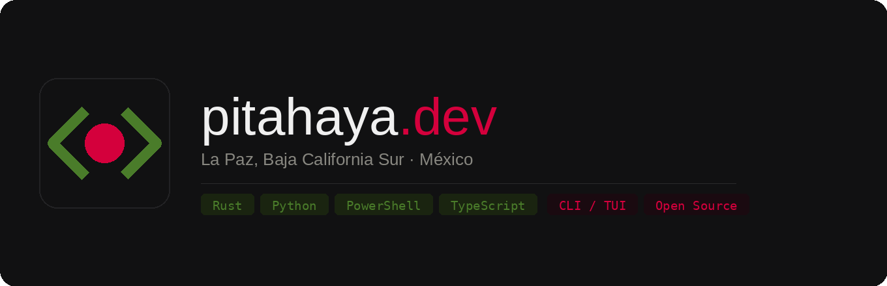

---

## What we build

We build tools for developers who live in the terminal. We stay in produce focused software that does one thing and gets out of the way.

From La Paz, Baja California Sur, México. Everything we ship is open source.

---

We write in Rust when performance and binary size matter, Python when iteration speed matters, PowerShell when the target is Windows and pretending otherwise would be dishonest, and TypeScript when the job requires a UI layer.

---

## Projects

**[poshbuddy](https://github.com/pitahayaDevSoft/poshbuddy)** `Rust` `MIT`  
TUI manager for Oh My Posh on Windows and PowerShell. Browse, preview, and switch themes interactively — no config file spelunking required.

**[pacwin](https://github.com/pitahayaDevSoft/pacwin)** `PowerShell` `MIT`  
A unified CLI for winget, Chocolatey, and Scoop. One command, pacman-style syntax, whichever backend actually has the package.

**[tropical-projectmanager](https://github.com/pitahayaDevSoft/tropical-projectmanager)** `Rust` `MIT`  
Navigate and manage local projects from the terminal. Visual, keyboard-driven, zero config to start.

**[mentask.py](https://github.com/pitahayaDevSoft/mentask.py)** `Python` `MIT`  
CLI-first AI agent written in pure Python. Connects to [models.dev](https://models.dev) — no vendor lock-in, no SDK overhead.

**[chorderizer](https://github.com/pitahayaDevSoft/chorderizer)** `Python` `MIT`  
Generates and exports chord progressions through a terminal interface. For musicians who prefer a keyboard over a mouse.

---

## Philosophy

We don't ship things we wouldn't use ourselves. Every project here started as a real gap in someone's workflow — not a portfolio piece, not a proof of concept left half-finished. If it's public, it works.

We have a bias toward the terminal because it composes well, runs everywhere, and respects the user's time. A good CLI is faster than any GUI for the task it's designed for. We hold that standard for everything we build.

---

## Contact

[pitahaya.dev](https://pitahaya.dev) · [fearlesslymediagroup@gmail.com](mailto:fearlesslymediagroup@gmail.com)
